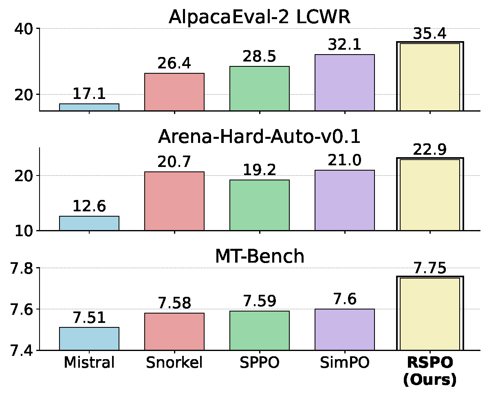
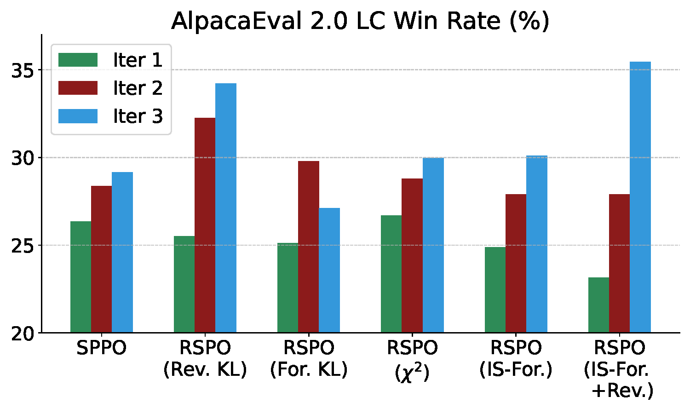
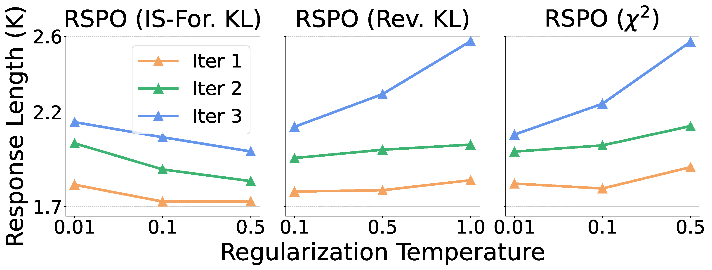
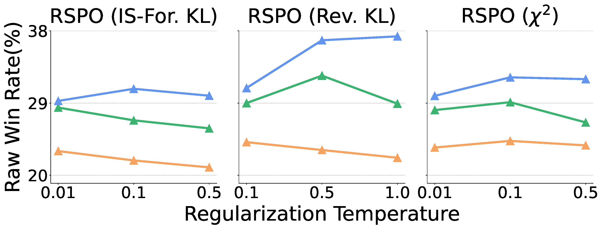

# RSPO: Regularized Self-Play Preference Optimization

     

This repository contains the official implementation of **Regularized Self-Play Preference Optimization (RSPO)**.

> **RSPO: Regularized Self-Play Alignment of Large Language Models**
> Xiaohang Tang, Sangwoong Yoon, Seongho Son, Huizhuo Yuan, Quanquan Gu, Ilija Bogunovic: [https://arxiv.org/abs/2503.00030](https://arxiv.org/abs/2503.00030)

## Overview

Self-play alignment formulates preference optimization as a two-player game and has emerged as an
effective approach for fine-tuning large language models (LLMs). However, the regularization with
respect to the reference policy, which is crucial for mitigating over-optimization, has been
insufficiently investigated in self-play alignment.

**RSPO** is a general and modular framework that unifies prior self-play methods and enables simple
plug-and-play integration of various regularizers, while preserving convergence to the Nash
equilibrium of the corresponding regularized game. Our large-scale study (over 120 fine-tuned
Mistral-7B-Instruct models) shows that:

- **Forward KL** divergence regularization reduces response length.
- **Reverse KL** divergence markedly improves raw win rates.
- A **linear combination of forward and reverse KL** boosts the length-controlled win rate on
  AlpacaEval-2 from `28.5%` (unregularized self-play, SPPO) to `35.4%`, and consistently improves
  Arena-Hard, MT-Bench, ArmoRM scores, and response diversity.

For full details, please refer to the [paper](https://arxiv.org/abs/2503.00030).

## Repository Structure

```text
.
├── README.md                       # This file
├── README_EVAL.md                  # Detailed evaluation / AlpacaEval / SelfBLEU instructions
├── LICENSE
├── setup.py                        # Package definition and dependencies
├── setup.cfg
├── .pre-commit-config.yaml
│
├── sppo/                           # Core training package
│   ├── alignment/                  # Config, data, and model utilities (alignment-handbook based)
│   │   ├── __init__.py
│   │   ├── configs.py
│   │   ├── data.py
│   │   ├── model_utils.py
│   │   └── release.py
│   ├── run_sft.py                  # Supervised fine-tuning entry point
│   ├── run_sppo.py                 # Unregularized self-play (SPPO) entry point
│   ├── run_sppo_reg.py             # Regularized self-play (RSPO) entry point
│   ├── trainer.py                  # SPPO trainer
│   └── trainer_reg.py              # RSPO trainer (forward/reverse KL and other regularizers)
│
├── scripts/                        # Launchers and pipeline components
│   ├── run_sppo_mistral.sh             # SPPO baseline (Mistral-7B-Instruct)
│   ├── run_sppo_llama-3.sh             # SPPO baseline (Llama-3-8B-Instruct)
│   ├── run_sppo_gemma-2.sh             # SPPO baseline (Gemma-2)
│   ├── run_sppo_gemma-2-2b.sh          # SPPO baseline (Gemma-2-2B-IT)
│   ├── run_sppo_gemma-2-27b.sh         # SPPO baseline (Gemma-2-27B)
│   ├── run_sppo_mistral_ABC_reg.sh     # RSPO (Mistral, ABC prompt schedule)
│   ├── run_sppo_llama-3_ABC_reg.sh     # RSPO (Llama-3, ABC prompt schedule)
│   ├── run_sppo_gemma-2-2b_ABC_reg.sh  # RSPO (Gemma-2-2B, ABC prompt schedule)
│   ├── run_mistral_sppo_exp_reg.sh     # RSPO regularizer sweep (Mistral)
│   ├── run_sppo_mistral_fixedprompt.sh     # SPPO with a fixed prompt set
│   ├── run_sppo_mistral_fixedprompt_reg.sh # RSPO with a fixed prompt set
│   ├── run_nash_md_mistral_ABC.sh      # Nash-MD baseline (online, via TRL)
│   ├── run_selfbleu.sh                 # SelfBLEU diversity evaluation launcher
│   ├── generate.sh                     # Multi-GPU generation wrapper (vllm)
│   ├── generate.py                     # Response generation (vllm)
│   ├── combine_generate.py             # Merge per-GPU generation shards
│   ├── rank.py                         # PairRM ranking of generated samples
│   ├── compute_prob.py                 # Compute preference probabilities / scores
│   ├── update_dataset.py               # Inject dataset name into training config
│   ├── pipeline.sh                     # SPPO training pipeline
│   ├── pipeline_reg.sh                 # RSPO training pipeline (loss_type + reg_coef)
│   ├── pipeline_llama3.sh              # Llama-3 specific training pipeline
│   ├── preload.py                      # Pre-download models / datasets
│   └── upload_model.py                 # Push trained checkpoints to the Hub
│
├── recipes/                        # Accelerate / DeepSpeed configs and training recipes
│   ├── accelerate_configs/         # deepspeed_zero3*.yaml, multi_gpu.yaml
│   └── uclaml-sppo/config_full.yaml
│
├── models_configs/                 # AlpacaEval model configs (configs.yaml, prompts.txt)
├── notebooks/                      # Data inspection and reverse-KL analysis notebooks
│   ├── inspect_data.ipynb
│   └── plot_reverse_kl.ipynb
├── fig/figures/                    # Paper figures (PDF)
├── images/                         # README images
├── eval_selfbleu.py                # SelfBLEU diversity evaluation
├── test_alpacaeval.py              # Manual AlpacaEval response generation (supports LoRA)
└── plot.ipynb                      # Plotting notebook
```

## Environment Setup

The training code is based on the [alignment-handbook](https://github.com/huggingface/alignment-handbook)
codebase. We use [`vllm`](https://github.com/vllm-project/vllm) for generation and
[PairRM](https://github.com/yuchenlin/LLM-Blender) for ranking.

```bash
# 1. Create a virtual environment
conda create -n rspo python=3.10
conda activate rspo

# 2. Install vllm for generation
pip install vllm

# 3. Install PairRM for ranking
git clone https://github.com/yuchenlin/LLM-Blender.git
cd LLM-Blender
pip install -e .
cd ..

# 4. Install this repository (training dependencies)
pip install -e .
```

For the Nash-MD baseline (`scripts/run_nash_md_mistral_ABC.sh`), install a recent TRL:

```bash
pip install "trl>=1.0"
```

> **Note:** Some scripts attempt to push datasets/models to the Hugging Face Hub. Make sure you are
> logged in (`huggingface-cli login` with a write token) and adjust the organization name in the
> scripts if needed, or comment out the `push_to_hub` calls.

## How to Launch Runs

All launchers live in `scripts/` and are designed to be executed **from the repository root** so
that relative paths (e.g. `scripts/generate.sh`, `recipes/...`) resolve correctly.

### Regularized Self-Play (RSPO)

Run a full 3-iteration RSPO training loop (generation → PairRM ranking → regularized training):

```bash
# Mistral-7B-Instruct-v0.2
bash scripts/run_sppo_mistral_ABC_reg.sh

# Llama-3-8B-Instruct
bash scripts/run_sppo_llama-3_ABC_reg.sh

# Gemma-2-2B-IT
bash scripts/run_sppo_gemma-2-2b_ABC_reg.sh
```

Each launcher selects the regularizer through two variables at the top of the script:

- `LOSS_TYPE` — the regularizer / objective, e.g.:
  - `sppo` — unregularized self-play (baseline)
  - `sppo_reversekl` — reverse KL regularization (best raw win rate)
  - `sppo_forwardimportance<k>` — forward KL via importance weighting (reduces length)
  - `sppo_forward1reverse<k>` — linear combination of forward + reverse KL (best LC win rate)
- `REG_COEF` — the regularization coefficient (e.g. `0.1`, `0.5`).

To sweep multiple regularizer / coefficient combinations on Mistral, edit the `exp_list` array in
`scripts/run_mistral_sppo_exp_reg.sh` and run:

```bash
bash scripts/run_mistral_sppo_exp_reg.sh
```

### Unregularized Self-Play (SPPO baseline)

```bash
bash scripts/run_sppo_mistral.sh     # Mistral-7B-Instruct-v0.2
bash scripts/run_sppo_llama-3.sh     # Llama-3-8B-Instruct
bash scripts/run_sppo_gemma-2.sh     # Gemma-2
bash scripts/run_sppo_gemma-2-2b.sh  # Gemma-2-2B-IT
```

### Nash-MD baseline

An online self-play baseline using TRL's Nash-MD trainer (no offline generation step):

```bash
bash scripts/run_nash_md_mistral_ABC.sh
```

### Pipeline Components

The launchers above orchestrate the following building blocks, which can also be run individually:

1. **Generation** — sample candidate responses with `vllm`:

```bash
python scripts/generate.py --model $MODEL --maxlen 2048 --output_dir $OUTPUT_DIR --prompts $PROMPTS
```

  Key arguments: `model`, `maxlen`, `pairs` (samples per prompt, default 5), `output_dir`, `prompts`,
  and `frac_len` / `data_frac` for splitting prompts across multiple GPUs. See `scripts/generate.sh`
  for a multi-GPU example.

2. **Ranking** — score candidates with PairRM:

```bash
python scripts/rank.py --output_dir $OUTPUT_DIR --prompts $PROMPTS
```

3. **Training** — run a single regularized self-play iteration:

```bash
bash scripts/pipeline_reg.sh --model $MODEL --iter $ITER --dataset $DATASET \
    --output_dir $OUTPUT_DIR --num 1 --loss_type $LOSS_TYPE --reg_coef $REG_COEF
```

  The unregularized counterpart is `scripts/pipeline.sh` (no `--loss_type` / `--reg_coef`).

> **GPU configuration:** set the available GPUs in `scripts/generate.sh` (`AVAILABLE_GPUS`), the
> threads/devices in `scripts/pipeline*.sh`, and `num_processes` in
> `recipes/accelerate_configs/*.yaml` to match your machine.

## Evaluation

We follow standard evaluation protocols using the following repositories:

- [AlpacaEval 2](https://github.com/tatsu-lab/alpaca_eval)
- [Arena-Hard](https://github.com/lmarena/arena-hard-auto)
- [MT-Bench](https://github.com/lm-sys/FastChat/tree/main/fastchat/llm_judge)
- [HuggingFace Open LLM Leaderboard](https://huggingface.co/spaces/open-llm-leaderboard/open_llm_leaderboard)

Model configurations used for AlpacaEval 2 are provided in `models_configs/`. Step-by-step
instructions for AlpacaEval, manual response generation (`test_alpacaeval.py`), and response
diversity via SelfBLEU (`eval_selfbleu.py` / `scripts/run_selfbleu.sh`) are documented in
[`README_EVAL.md`](README_EVAL.md).

## Results & Visualization

Below are the main RSPO results compared to unregularized self-play:


<table>
  <tr>
    <td></td>
    <td></td>
  </tr>
  <tr>
    <td></td>
    <td></td>
  </tr>
</table>

## Citation

If you find RSPO useful in your research, please cite:

```bibtex
@article{tang2025rspo,
  title={RSPO: Regularized Self-Play Alignment of Large Language Models},
  author={Tang, Xiaohang and Yoon, Sangwoong and Son, Seongho and Yuan, Huizhuo and Gu, Quanquan and Bogunovic, Ilija},
  journal={arXiv preprint arXiv:2503.00030},
  year={2025}
}
```

## Acknowledgements

This codebase builds on [SPPO](https://github.com/uclaml/SPPO) and
[The Alignment Handbook](https://github.com/huggingface/alignment-handbook). We also rely on
[PairRM](https://github.com/yuchenlin/LLM-Blender) for ranking and
[vllm](https://github.com/vllm-project/vllm) for generation.
